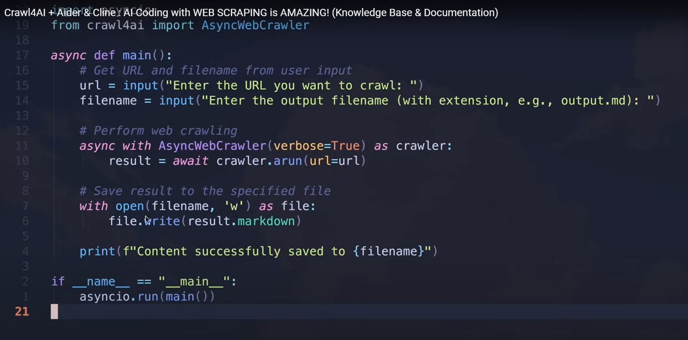

# Crawl4AI Website Scraper for LLM-Friendly Documentation

This project provides tools to create local, searchable Markdown copies of any website content using [Crawl4AI](https://github.com/unclecode/crawl4ai).

## Setup

### Step 1: Create a Virtual Environment

```bash
# Create a virtual environment named .venv
python -m venv .venv

# Activate the virtual environment
# On Windows:
.venv\Scripts\activate
# On macOS/Linux:
# source .venv/bin/activate
```

### Step 2: Install Dependencies

```bash
# Install required packages
pip install -r requirements.txt

# Run post-installation setup (it will install Playwright browser binaries)
crawl4ai-setup

# Optionally verify installation (may not work behind corporate firewalls)
crawl4ai-doctor
```

## Main Tool: Website Folder Crawler

The `scrape_folder_to_markdown.py` script is a powerful, generic crawler that can scrape any website section and save its content as Markdown files.

### Features

- Automatically crawls an entire website section with configurable depth
- Maintains folder structure that mirrors the original website
- Filters URLs to stay within the section you specify
- Uses smart path handling to create well-organized local files
- Includes progress reporting and error handling

### Usage

```bash
# Basic usage
python src/scrape_folder_to_markdown.py <start-url> <output-directory>

# With optional parameters
python src/scrape_folder_to_markdown.py <start-url> <output-directory> --depth <max-depth> --quiet
```

### Examples

```bash
# Scrape VS Code API documentation (depth: 3)
python src/scrape_folder_to_markdown.py https://code.visualstudio.com/api vscode_docs

# Scrape Python documentation with greater depth (depth: 5)
python src/scrape_folder_to_markdown.py https://docs.python.org/3/library python_docs --depth 5

# Scrape Anthropic's Prompt Engineering guide with minimal logging
python src/scrape_folder_to_markdown.py https://docs.anthropic.com/en/docs/build-with-claude/prompt-engineering/ anthropic_guide --quiet
```

After running, your output directory will contain Markdown files that can be used with AI assistants like Claude, ChatGPT, or coding tools like Aider and Cline.

## Additional Tools

### Single Page Scraper

For quick single-page conversions, you can use the standalone script:

```bash
python src/scrape_page_to_markdown.py
```

This tool implements the idea from [@AICodeKing](https://www.youtube.com/@AICodeKing)'s video [Crawl4AI + Aider & Cline : AI Coding with WEB SCRAPING is AMAZING!](https://www.youtube.com/watch?v=W7V1J6EFiUs):



### VS Code API Documentation Scraper

For a specialized VS Code API scraper with pre-configured settings:

```bash
python src/scrape_vscode_api_docs.py
```

## Troubleshooting

If you encounter browser-related issues, you can install browsers manually:

```bash
# Install only Chromium (recommended for this project)
python -m playwright install chromium

# OR for full installation with system dependencies (needed on some Linux systems)
python -m playwright install --with-deps chromium
```

## License & Attribution

This project is licensed under the Apache License 2.0 with a required attribution clause. See the [Apache 2.0 License](https://github.com/unclecode/crawl4ai/blob/main/LICENSE) file for details.

<a href="https://github.com/unclecode/crawl4ai">
  
</a>
